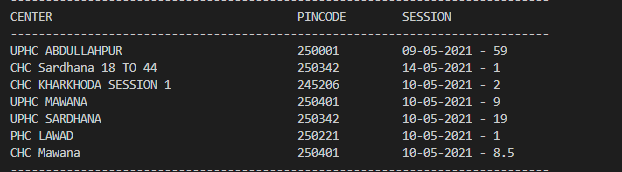

# CoWIN-Slot-Search
Poll cowin apis for auto search empty slots

## Compile
- git clone https://github.com/sonuame/CoWIN-Slot-Search.git cowin --depth=1
- cd cowin
- yarn install
- node index Delhi "Central Delhi" 2000

## RUN
```node index --state=<STATE> --city=<CITY> --polling=<POLL DURATION> --age=<AGE LIMIT = 18 |45> --date=<DATE - mm-dd-yyyy> ```\
```node index --state="Uttar Pradesh" --city=Meerut --polling=2000 --age=18 --date=10-05-2021```


## Result



## Usage
data is also available in JSON format in the variable "availabeSlot". Use it for further processing like creating email notification or displaying on a web page
